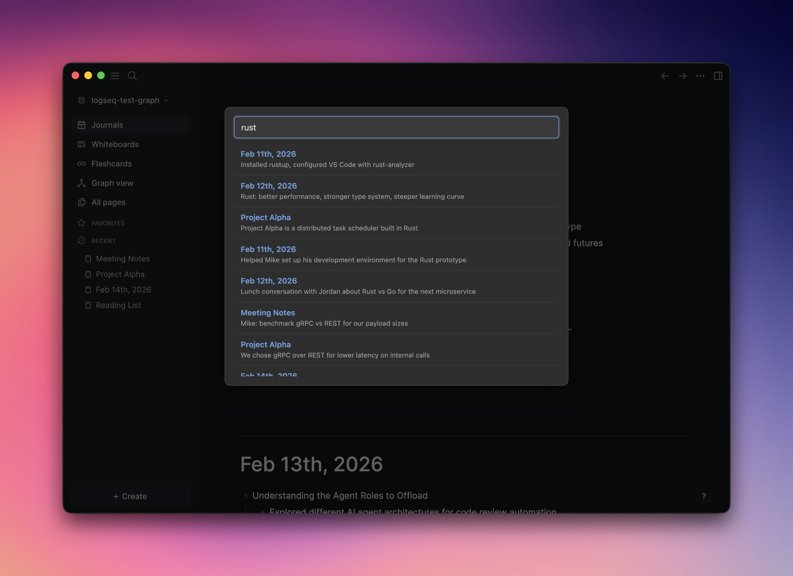
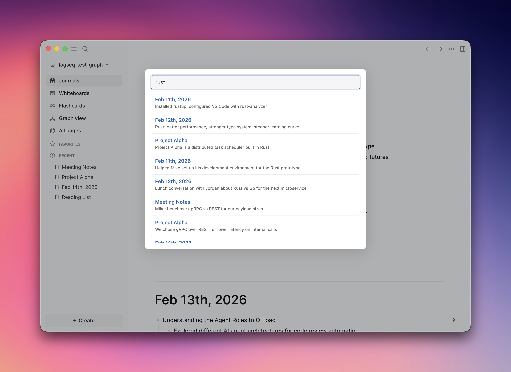

# Fuzzy Search for Logseq

Fast fuzzy search across all your Logseq pages and blocks with typo tolerance and relevance ranking. Powered by [MiniSearch](https://github.com/lucaong/minisearch).

!! Fuzzy search was developed for the original Markdown (MD) based version of Logseq, not Logseq DB.

## Screenshots



## Features

- **Fuzzy matching** — tolerates typos (up to 20% character difference)
- **Prefix search** — matches as you type
- **Block-level results** — navigates directly to the matching block
- **Relevance ranking** — page names weighted higher, BM25 scoring
- **Instant results** — index built at startup, auto-refreshes on changes
- **Keyboard navigation** — arrow keys to browse, Enter to open
- **Keyboard shortcut** — `Cmd+Shift+S` (Mac) / `Ctrl+Shift+S` (Windows/Linux)

## Installation

### From Logseq Marketplace
1. Open Logseq → Plugins → Marketplace
2. Search for "Fuzzy Search"
3. Click Install

### Manual
1. Download the latest release zip
2. In Logseq, go to Plugins → Load unpacked plugin
3. Select the extracted folder

## Usage

- Press `Cmd+Shift+S` (Mac) or `Ctrl+Shift+S` (Windows/Linux)
- Or use Command Palette → "Open Fuzzy Search"
- Type your query — results appear instantly
- Use `↑`/`↓` arrow keys to navigate results
- Press `Enter` to open the selected result (or the first result)
- Click a result to navigate to that block
- Press `Escape` or click outside to close

## Development

```bash
npm install
npm run build
```

## License

MIT
